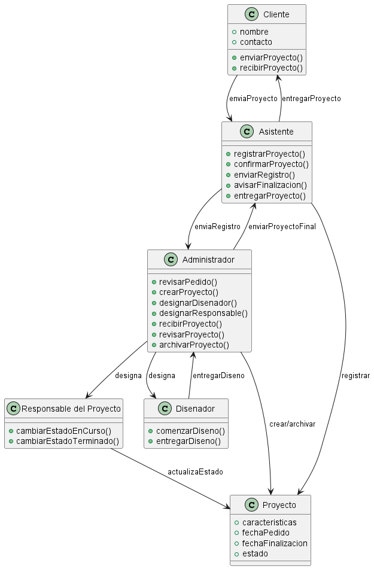

# Introduccion

-**Descripción del paradigma orientado a objetos:**

Es un paradigma de programación basado en la organización del código en torno a "objetos" que representan entidades del mundo real. Cada objeto encapsula datos y comportamientos que lo definen y lo hacen interactuar con otros objetos. Este enfoque permite mejorar la reutilización del código, la modularidad y la mantenibilidad de los sistemas.

# Fundamentos de la Programación Orientada a Objetos

-**Abstracción**

La abstracción facilita la creación de modelos simplificados de sistemas complejos, enfocándose en los aspectos esenciales. Permite ocultar los detalles internos y presentar una interfaz simple y comprensible.

Ejemplo:
Al modelar el objeto RecursoAudiovisual, solo se abstraen los atributos necesarios: tipo (video, audio, imagen), duración, formato, peso en MB. No es relevante guardar detalles como “marca de la computadora usada para editar” o “temperatura de la sala de grabación”. Esto permite que el sistema maneje recursos de forma homogénea sin sobrecargar con información inútil.

-**Encapsulamiento**

El encapsulamiento consiste en ocultar los detalles internos de un objeto y exponer solo lo necesario. Solo se pueden modificar o consultar mediante métodos definidos. Esto evita errores y protege la integridad de los datos.

Ejemplo:
Una clase Presupuesto tiene atributos privados como montoTotal y gastosRegistrados. El sistema no debería permitir que alguien modifique directamente estos valores. En su lugar, existirían métodos controlados como agregarGasto(monto) o actualizarMontoTotal(nuevoMonto), que validan que el monto no sea negativo y que los gastos no superen lo autorizado.
De esta forma, se protege la integridad de los datos financieros del proyecto.

-**Herencia**

La herencia permite que una clase derive de otra, reutilizando atributos y métodos. Esto permite crear una jerarquía de clases donde las más específicas amplían o especializan a las más generales.

Ejemplo:
Una clase base RecursoHumano incluye atributos comunes: nombre, rol, contacto.
De ella heredan:
Camarógrafo (añade atributo equipoAsignado)
Sonidista (añade atributo tipoDeMicrofono)
Actor (añade atributo papelAsignado)
Así se evitan duplicaciones de código y se aprovecha la reutilización.

-**Polimorfismo**

El polimorfismo permite que diferentes clases respondan de manera distinta a un mismo método.

Ejemplo:
Un método exportarProyecto() puede comportarse distinto según el tipo de salida:
Si es un VideoFinal, lo exporta en MP4.
Si es un AudioFinal, lo exporta en WAV.
Si es un Storyboard, lo exporta en PDF.
El mismo método existe en diferentes clases, pero su implementación se adapta según el tipo de recurso.

-**Requisitos Funcionales**

• Gestión de Proyectos:

     El sistema debe permitir crear y editar proyectos, registrando al menos: nombre, cliente, fechas de inicio y fin estimadas, estado actual y observaciones.
     
• Gestión de Etapas y Tareas:

    El sistema debe permitir agregar y modificar etapas en un proyecto, indicando responsable, estado (Pendiente, En curso, Finalizada), fechas estimadas y observaciones.
    
• Tablero de control:

    El sistema debe mostrar un panel general donde se visualice el estado de todos los proyectos y sus etapas, indicando si están en curso, finalizados o pausados y el responsable de cada etapa.

• Notificaciones automáticas:

    El sistema debe enviar notificaciones automáticas (por mail y WhatsApp) al responsable cuando:  
      - Se le asigna una nueva etapa.  
      - Cambia el estado de su etapa.  
      - Una etapa a su cargo pasa a “Finalizada”.

• Registro estadístico:

    El sistema debe permitir **consultar métricas de proyectos y etapas, incluyendo:  
      - Cantidad de proyectos entregados por mes.  
      - Duración promedio de proyectos y etapas.  
      - Proyectos filtrados por cliente o tipo.
    
-**Requisitos No Funcionales**

• Facilidad de uso

    El sistema debe permitir que un usuario nuevo realice su primera acción (crear proyecto o etapa), con menús y filtros accesibles.

• Accesibilidad y Responsividad:

    El sistema debe estar disponible desde navegadores web de escritorio y móviles (Chrome, Edge, Safari) y ser responsive.

• Persistencia de Datos:

    El sistema debe guardar automáticamente cada cambio en proyectos y etapas, garantizando persistencia aunque se recargue la página.
    
• Rendimiento:

    El sistema debe permitir consultar y filtrar proyectos sin que el tiempo de respuesta supere 3 segundos en escenarios con hasta 50 proyectos activos y 200 etapas.

• Escalabilidad:

    El sistema debe soportar la gestión de al menos 100 proyectos en simultáneo, con posibilidad de extender a nuevas funciones como facturación sin rediseño completo.

# Casos de Uso

### Crear/Editar Proyecto

-**Actor(es):** Productor/Coordinador, Cliente/Administrador

-**Descripción:** Registrar o actualizar un proyecto con sus datos mínimos y dejarlo disponible para seguimiento.  

-**Flujo principal:**

  1. El actor navega a **Proyectos** y selecciona **Nuevo** o **Editar**.  
  2. El sistema muestra un **formulario** con campos: nombre, cliente, fechas de inicio y fin estimada, estado, observaciones.  
  3. El actor **completa** los campos obligatorios.  
  4. El sistema **valida** (obligatorios, formato de fechas, duplicados de nombre).  
  5. Si hay errores, el sistema **resalta** los campos inválidos y muestra mensajes.  
  6. El actor **corrige** y reenvía.  
  7. El sistema **persiste** el proyecto y registra auditoría (quién/cuándo).
  8. El **Servicio de Notificaciones** envía aviso de "proyecto creado/editado" al cliente y/o administrador.  
  9. El sistema **confirma** y redirige al detalle del proyecto.
      
-**Precondiciones:** Usuario autenticado con permiso; el nombre del proyecto no debe estar duplicado.  

-**Postcondiciones:** Proyecto persistido y disponible en listados/tablero.

### Gestionar Etapas de un Proyecto

-**Actor(es):** Coordinador, Usuario responsable, servicio de notificaciones. 

-**Descripción:** Agregar, editar o eliminar etapas de un proyecto.  

-**Flujo principal:**

  1. El coordinador abre el **detalle del proyecto** y selecciona **Gestionar etapas**.  
  2. El sistema muestra la **lista de etapas** (si existen).  
  3. El coordinador elige **Agregar**, **Editar** o **Eliminar**.  
  4. El sistema despliega formulario con **nombre, responsable, estado, fechas estimadas, observaciones**.  
  5. El coordinador completa o modifica los campos y confirma.  
  6. El sistema **valida** (responsable válido, fechas coherentes, estado permitido).  
  7. El sistema **guarda** los cambios y registra el evento (alta/edición/baja).
  8. El **servicio de notificaciones** envía aviso al **usuario responsable** asignado afectado por la modificación.  
  9. El sistema **actualiza** la lista y muestra confirmación al coordinador.  

-**Precondiciones:** Proyecto existente; actor con permisos.  

-**Postcondiciones:** Etapas actualizadas y reflejadas en el tablero.

### Asignar Responsable a Etapa

-**Actor(es):** Coordinador, usuario responsable, servicio de notificaciones.  

-**Descripción:** Asignar o cambiar el responsable de una etapa y notificarlo.  

-**Flujo principal:**

  1. El coordinador abre el **detalle** del proyecto y selecciona una etapa.  
  2. El sistema muestra los datos actuales de la etapa.  
  3. El coordinador selecciona en **Asignar/Cambiar responsable**.  
  4. El sistema despliega un **selector de usuarios**.  
  5. El coordinador elige al responsable y confirma.  
  6. El sistema valida el usuario y actualiza la etapa.  
  7. El sistema registra el cambio en el **historial** (quién, a quién, cuándo).  
  8. El servicio de notificaciones envía un aviso al **usuario responsable** indicando la asignación/cambio.
  9. El sistema muestra confirmación al coordinador.
      
-**Precondiciones:** Etapa existente; usuario válido en el sistema, coordinador autenticado con permisos para asignar responsables.  

-**Postcondiciones:** Responsable asignado; notificación enviada a usuario responsable; historial actualizado.

### Cambiar Estado de Etapa

-**Actor(es):** Responsable de la etapa/Coordinador, Servicio de notificaciones.

-**Descripción:**  Modificar el estado de una etapa respetando reglas de negocio establecidas.  

-**Flujo principal:**

  1. El actor abre el detalle de la etapa.  
  2. El sistema muestra estado actual y opciones: Pendiente, En curso, Finalizada.  
  3. El actor selecciona un nuevo estado y confirma.  
  4. El sistema valida reglas (p.ej. no finalizar si tareas incompletas).  
  5. Si la validación falla, muestra error.  
  6. Si es correcta, el sistema **actualiza el estado de la etapa**.  
  7. El sistema registra el cambio en **historial**.  
  8. El **servicio de notificaciones** envía notificación a los interesados.
      - Si el cambio lo hizo el Responsable → se notifica al Coordinador.
      - Si el cambio lo hizo el Coordinador → se notifica al Responsable.
  9. El sistema muestra confirmación al actor principal.
      
-**Precondiciones:** Etapa existente; usuario autenticado y con permisos.  

-**Postcondiciones:** Estado actualizado; historial y notificaciones registradas.

### Enviar Notificaciones Automáticas

-**Actor(es):** Coordinador/Responsable de etapa, Servicio de notificaciones, destinatario 

-**Descripción:** Avisar automáticamente a los usuarios responsables ante eventos relevantes en proyectos o etapas. 

-**Flujo principal:**

  1. El Coordinador o Responsable realiza una acción relevante (ej.: asignar responsable, cambiar estado).  
  2. El sistema identifica destinatarios según el evento.  
  3. El sistema determina canal de notificación según preferencias de cada usuario.  
  4. El sistema compone mensaje con datos del proyecto/etapa.  
  5. El **servicio de notificaciones** envía la notificación al destinatario.  
  6. El servicio de notificaciones devuelve resultado (éxito/fallo).  
  7. El sistema registra el envío en historial de notificaciones.  
  8. Si falla, reintenta o marca la notificación para revisión.
     
-**Precondiciones:** Usuario con canal de notificación definido; conexión con servicio de notificaciones. 

-**Postcondiciones:** Notificación registrada; destinatarios informados.

# Boceto Inicial del Diseño de Clases

[Ir a la sección Diagramas](https://drive.google.com/file/d/1A0j3wN0qF8jCNqg29rq2CDcZzCWzdf0H/view)

