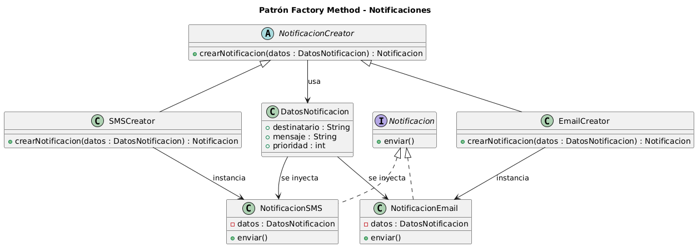

# Anexo – Aplicación de Patrón de Diseño Creacional – Factory Method

---

## Patrones de Diseño Creacionales y su relación con SOLID

Los patrones de diseño creacionales se enfocan en controlar la creación de objetos dentro de un sistema, favoreciendo el desacoplamiento y la extensibilidad.  
Este tipo de patrones está profundamente relacionado con SOLID:

- **S – Responsabilidad Única:** la creación de objetos se aísla en componentes dedicados.
- **O – Abierto/Cerrado:** permite extender el sistema agregando nuevos productos sin modificar código existente.
- **D – Inversión de Dependencia:** los clientes trabajan con abstracciones, no con implementaciones concretas.

En el proyecto, la generación de notificaciones estaba dispersa y acoplada a distintos componentes, lo que violaba estos principios.

---

## Propósito y Tipo del Patrón

### Propósito

Desacoplar la creación de objetos de notificación del resto del sistema, permitiendo:

- Centralizar cómo se crean las notificaciones.
- Agregar nuevos tipos sin modificar clases existentes.
- Reducir el acoplamiento entre las clases del dominio y el sistema de comunicación.

### Tipo

El patrón elegido es **Factory Method**, porque permite delegar la creación de los objetos concretos (`EmailNotificacion`, `PushNotificacion`, `NotificacionInterna`) a subclases especializadas, manteniendo el código cliente trabajando únicamente con la abstracción `Notificacion`.

---

## Motivación

Antes de aplicar el patrón:

- Cada clase del sistema creaba notificaciones manualmente.
- La lógica de creación estaba repetida y dispersa en varias clases.
- Para agregar un nuevo tipo de notificación había que modificar múltiples componentes.

Esto provocaba problemas de:

- Acoplamiento alto.
- Falta de extensibilidad.
- Violación del principio Open/Closed.
- Dificultad de mantenimiento.

### Con el patrón aplicado:

Se incorporan nuevas clases:

- **NotificacionCreator** (creador abstracto)
- **EmailNotificacionCreator**, **PushNotificacionCreator**, **InternaNotificacionCreator** (creadores concretos)
- **EmailNotificacion**, **PushNotificacion**, **NotificacionInterna** (productos concretos)

Ahora, cada tipo de notificación se crea mediante un Creator específico, y el sistema queda abierto a nuevas extensiones.

---

## Estructura de Clases

A continuación se presenta el diagrama UML correspondiente a la implementación del patrón Factory Method dentro del sistema:

---

## Justificación Técnica de la Estructura de Clases

A continuación se detalla el rol técnico de cada una de las clases que participan en el patrón **Factory Method**:

---

### **Notificacion (Interfaz)**

- **Responsabilidad:** definir el comportamiento genérico `enviar()`.
- **Relación:** es implementada por todas las notificaciones concretas.
- **Justificación:** permite que el sistema dependa de una abstracción estable.

---

### **EmailNotificacion / PushNotificacion / NotificacionInterna**

- **Responsabilidad:** implementar `enviar()` según el canal correspondiente.
- **Relación:** son instanciadas exclusivamente por los creadores concretos.
- **Justificación:** representan la **variabilidad del producto** dentro del patrón.

---

### **NotificacionCreator (Clase abstracta)**

- **Responsabilidad:** declarar el **Factory Method** `crearNotificacion()`.
- **Relación:** clase padre de todos los creadores concretos.
- **Justificación:** encapsula el **esqueleto del proceso de creación y envío**.

Incluye un **método de plantilla** `procesarEnvio()` que ejecuta pasos comunes sin conocer el tipo concreto.

---

### **EmailNotificacionCreator / PushNotificacionCreator / NotificacionInternaCreator**

- **Responsabilidad:** crear el tipo concreto correspondiente.
- **Relación:** implementan el Factory Method.
- **Justificación:** permiten extender el sistema agregando nuevas subclases sin modificar código existente (**Principio Open/Closed**).

---

## Explicación del Flujo de Creación de Objetos

1. Una clase del dominio necesita enviar una notificación.
2. Instancia el **Creator** adecuado según el tipo requerido.
3. Invoca `procesarEnvio()`.
4. El método plantilla llama a `crearNotificacion()`.
5. El Creator concreto construye la notificación específica.
6. El objeto devuelto ejecuta `enviar()`, completando el proceso.

---

Este flujo elimina dependencias directas hacia clases concretas y facilita la extensibilidad del sistema, alineándose con buenas prácticas de diseño orientado a objetos.
