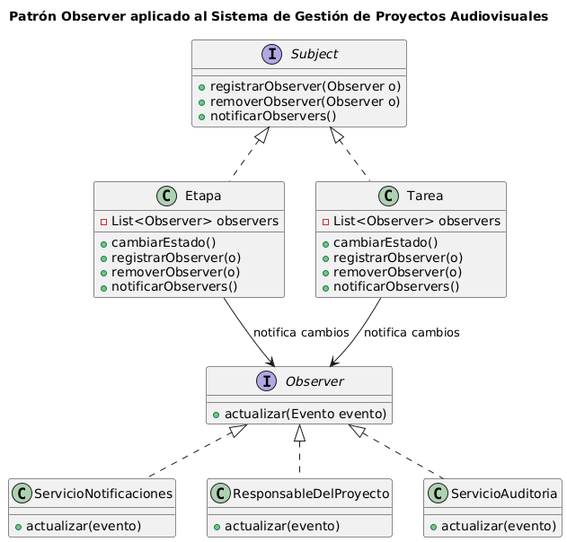

# Anexo – Aplicación de Patrón de Diseño de Comportamiento – Observer

## Patrones de Diseño de Comportamiento y su relación con SOLID

Los patrones de diseño de comportamiento definen cómo los objetos interactúan entre sí para distribuir responsabilidades y evitar dependencias rígidas. Su propósito es mejorar la flexibilidad del sistema, promover interacciones desacopladas y favorecer la extensibilidad del comportamiento.

### Relación con SOLID

- **S – Responsabilidad Única:** cada objeto cumple un rol claro dentro del comportamiento.  
- **O – Abierto/Cerrado:** es posible agregar nuevos comportamientos sin alterar el código existente (nuevos observadores).  
- **L – Sustitución de Liskov:** los observadores pueden sustituirse mientras respeten la interfaz.  
- **I – Segregación de Interfaces:** los objetos implementan solo los métodos necesarios (Observer/Subject).  
- **D – Inversión de Dependencias:** los sujetos dependen de abstracciones, no de clases concretas.  

---

## Propósito y Tipo del Patrón

### Propósito  
Implementar un mecanismo para notificar automáticamente a distintos actores del sistema cuando se produce un cambio en una entidad clave, sin generar acoplamiento directo entre ellos.

### Tipo de patrón  
**Patrón de comportamiento.**  
Define cómo se comunican los objetos evitando dependencias rígidas entre ellos.

---

## Motivación

El Sistema de Gestión de Proyectos Audiovisuales presenta un problema importante:

Cuando cambia el estado de una **Etapa** o una **Tarea**, múltiples componentes requieren ser informados:

- Responsable del proyecto  
- Servicios de notificaciones  
- Auditoría  
- Panel del administrador  
- Visores del cliente  

Actualmente, estas notificaciones están “quemadas” dentro de varias clases, provocando:

- Acoplamiento fuerte entre dominio y servicios externos  
- Duplicación de lógica de notificación  
- Dificultad para agregar nuevos interesados  
- Violación de SRP y DIP (mezcla de reglas de negocio con infraestructuras)  

El patrón **Observer** permite que *Etapa* y *Tarea* actúen como Sujetos, notificando automáticamente a cualquier Observador registrado, sin conocer sus implementaciones.

Esto permite:

- Agregar nuevos observadores sin modificar las clases principales  
- Desacoplar el dominio de los servicios externos  
- Simplificar la orquestación interna  

---

## Estructura de Clases

La estructura aplicada incorpora dos roles fundamentales:

### **Subject (Sujeto)**
- Clase que presenta cambios en su estado (Etapa, Tarea).  
- Mantiene una lista de observadores.  
- Notifica ante cambios relevantes.

### **Observer (Observador)**
- Interfaz que implementan todos los interesados en recibir actualizaciones.  
- Cada implementación define su propio comportamiento ante una notificación.

### Implementaciones del patrón

- **Etapa** como Subject  
- **Tarea** como Subject  
- **ServicioNotificaciones** como Observer  
- **ResponsableDelProyecto** como Observer  
- **ServicioAuditoria** como Observer  

---

## Diagrama UML del Patrón Observer

