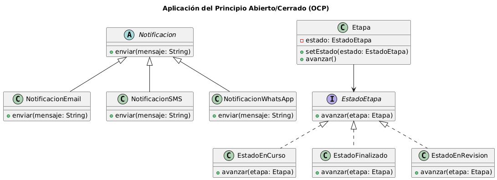

# Principio Abierto/Cerrado (OCP)

## Propósito y Tipo del Principio SOLID
El Principio Abierto/Cerrado (Open/Closed Principle) establece que las clases deben estar **abiertas a la extensión** pero **cerradas a la modificación**.  
Esto significa que el código debe poder crecer en funcionalidad sin necesidad de alterar las clases ya existentes, reduciendo errores y facilitando el mantenimiento.

---

## Motivación
En el sistema de **Vizion Estudio** surgen dos situaciones donde se aplica OCP:

1. **Gestión de Notificaciones**  
   - Problema: originalmente solo se necesitaba enviar notificaciones básicas, pero luego se incorporaron múltiples canales (Email, SMS, WhatsApp).  
   - Sin OCP: la clase `Notificacion` debería modificarse cada vez que aparece un nuevo canal.  
   - Con OCP: la clase base permanece intacta, y cada canal se implementa como una nueva subclase.  

2. **Gestión de Etapas del Proyecto**  
   - Problema: una etapa podía estar *En curso* o *Finalizada*, pero luego surgió la necesidad de otros estados (*En revisión*, *Pausado*).  
   - Sin OCP: la clase `Etapa` debería cambiar cada vez que se agregue un estado.  
   - Con OCP: la clase `Etapa` delega la lógica a la interfaz `EstadoEtapa`, y cada estado se implementa en una clase distinta.

---

## Explicación de Herencia
La **herencia** es una relación entre clases donde una clase hija (subclase) extiende el comportamiento de una clase base (superclase), reutilizando atributos y métodos.  

En este sistema:  
- `Notificacion` es abstracta → define el contrato común. Subclases (`NotificacionEmail`, `NotificacionSMS`) extienden el sistema con nuevos canales sin modificar la clase principal.  
- `Etapa` se apoya en la interfaz `EstadoEtapa` (patrón State). Cada estado (`EstadoEnCurso`, `EstadoFinalizado`) se implementa como clase separada, y se pueden agregar más sin alterar la clase `Etapa`.

---

## Estructura de Clases
En este sistema el OCP se aplica en dos áreas principales:  

- **Notificación**: la clase base `Notificacion` define los atributos y operaciones comunes. Cada canal de comunicación se representa como una subclase que hereda de ella. Esto asegura que no sea necesario modificar la clase principal cuando se incorpora un nuevo medio de notificación.  

- **Etapa del Proyecto**: la clase `Etapa` mantiene una referencia a la interfaz `EstadoEtapa`. Cada estado concreto se implementa como una clase independiente. Así, la lógica de `Etapa` nunca cambia y se pueden añadir nuevos estados sin modificar código existente.

---

## Justificación Técnica
El diseño orientado a OCP aporta los siguientes beneficios técnicos en este caso:

1. **Notificaciones**  
   - La clase abstracta `Notificacion` contiene la definición común para todos los canales.  
   - Cada implementación concreta (Email, SMS, WhatsApp) se añade mediante subclases.  
   - Esto evita modificar la clase central, garantizando extensibilidad con bajo riesgo de introducir errores.  

2. **Etapas de Proyecto**  
   - La clase `Etapa` no gestiona directamente la lógica de los estados, sino que delega en la interfaz `EstadoEtapa`.  
   - Cada estado concreto implementa la interfaz y define su propio comportamiento.  
   - Esto asegura que la lógica central de `Etapa` permanezca inalterada y que se puedan añadir nuevos estados sin tocar código existente.  