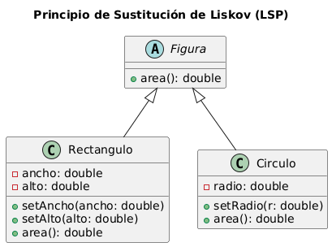

# Principio de Sustitución de Liskov (LSP)

## Propósito y Tipo del Principio SOLID
El **Principio de Sustitución de Liskov (LSP)** establece que los objetos de una subclase deben poder reemplazar a los de su clase base sin alterar el comportamiento esperado del sistema.  
Forma parte del grupo de principios **SOLID** y su propósito es mantener la coherencia en jerarquías de herencia, asegurando que la extensión del código no introduzca errores lógicos o inconsistencias.

## Motivación
En la productora audiovisual, los proyectos pueden ser de distintos tipos: **publicitarios, documentales o de cobertura de eventos**.  
Inicialmente, el sistema trataba todos los proyectos como iguales, pero cada tipo requería comportamientos diferentes (por ejemplo, un documental necesita entrevistas, mientras que un publicitario requiere guiones y locaciones).  
El problema surgía cuando se agregaban nuevos tipos de proyectos: el código debía modificarse constantemente para adaptarse, rompiendo la estabilidad del sistema.  

Aplicando **LSP**, se creó una jerarquía donde cada tipo de proyecto extiende una clase base `Proyecto` e implementa sus métodos (`iniciarProduccion()` y `entregarProyecto()`) sin alterar la estructura general.  
Esto permite que todos los proyectos se gestionen de forma uniforme sin necesidad de cambiar el código existente.

## Explicación de Herencia
En la programación orientada a objetos, la **herencia** define una relación “es-un” entre clases.  
- Una **superclase** (`Proyecto`) define el comportamiento general esperado por el sistema.  
- Las **subclases** (`ProyectoPublicitario`, `ProyectoDocumental`, `ProyectoEvento`) implementan comportamientos específicos sin romper las reglas establecidas por la clase base.  

De esta manera, cualquier subclase puede reemplazar a la clase `Proyecto` en cualquier parte del sistema sin causar errores, cumpliendo con el **Principio de Sustitución de Liskov**.

## Estructura de Clases

El siguiente diagrama UML muestra cómo las subclases implementan el contrato definido por `Proyecto`, garantizando que puedan sustituirla sin afectar el sistema.

El siguiente diagrama UML muestra la utilización solid LSP:  
  

## Justificación Técnica
En este sistema:  
- La clase abstracta `Proyecto` define el contrato común de producción audiovisual con métodos como `iniciarProduccion()` y `entregarProyecto()`.  
- Las subclases (`ProyectoPublicitario`, `ProyectoDocumental`, `ProyectoEvento`) extienden esta lógica respetando el mismo contrato.  
- Cada una redefine su comportamiento de manera independiente, pero sin alterar las reglas de la superclase.  

