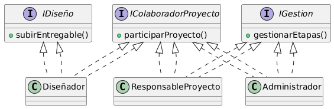

# Principio de Segregación de Interfaces (ISP)

## Propósito y Tipo del Principio SOLID

El Principio de Segregación de Interfaces (ISP) propone que las clases no deben depender de interfaces que no utilizan.  
Es mejor tener interfaces pequeñas y específicas que una sola interfaz con muchas operaciones.

---

## Motivación

En el diseño inicial, una interfaz hipotética **IUsuarioSistema** podía incluir métodos para diseñar, administrar proyectos y enviar notificaciones.  
Esto obliga a que clases como **Cliente** implementen métodos que no necesitan.

Con ISP se crean interfaces más pequeñas y enfocadas:

- **IColaboradorProyecto** (participar en proyectos).
- **IDiseño** (subir entregables).
- **IGestion** (gestionar etapas).

---

## Estructura de Clases

---

## Justificación Técnica

El diagrama muestra cómo aplicar ISP:

- **Diseñador** solo implementa lo que necesita (colaborar en proyectos y diseñar).

- **Administrador** y **Responsable** implementan gestión.

Así se evitan dependencias innecesarias, logrando un sistema más claro, flexible y con bajo acoplamiento.
