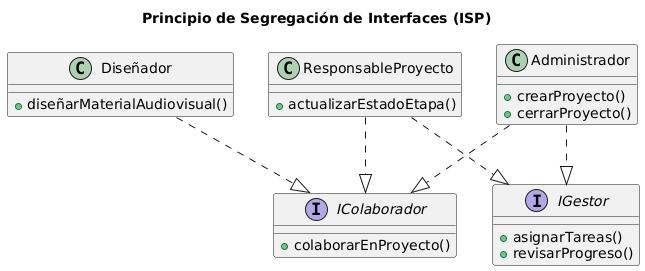

# Principio de Segregación de Interfaces (ISP)

## Propósito y Tipo del Principio SOLID

El Principio de Segregación de Interfaces (ISP) propone que las clases no deben depender de interfaces que no utilizan.  
Es mejor tener interfaces pequeñas y específicas que una sola interfaz con muchas operaciones.

---

## Motivación

En el diseño inicial, **Diseñador**, **Administrador** y **Responsable del Proyecto** compartían comportamientos comunes (participar o colaborar en proyectos), pero no todos gestionaban tareas o etapas.
Sin embargo, al definir una interfaz amplia (por ejemplo, “IGestion”), se forzaba a algunos roles a implementar operaciones que no les correspondían.

Aplicando ISP:

- Se **dividen las interfaces** según responsabilidades reales.

- IColaborador define las acciones comunes a todos los roles que participan en proyectos.

- IGestor define solo las acciones administrativas o de supervisión, y la implementan quienes realmente gestionan (Administrador y Responsable del Proyecto).

---

## Explicación de Interfaces

En programación orientada a objetos, una **interfaz** define un contrato que una clase debe cumplir, sin imponer detalles de implementación.  
El ISP propone que esas interfaces sean **cohesivas y específicas**, reduciendo la obligación de implementar operaciones innecesarias.

---

## Estructura de Clases

---

## Justificación Técnica

El diagrama muestra cómo aplicar ISP:

- **Diseñador** solo implementa IColaborador, porque su función es contribuir creativamente al proyecto, no gestionarlo.
- **Administrador** y **Responsable** implementan ambas interfaces, porque además de colaborar, también gestionan tareas o etapas.

Este enfoque reduce el acoplamiento y hace que cada clase tenga solo las dependencias que realmente necesita, respetando el principio de segregación de interfaces (ISP).
