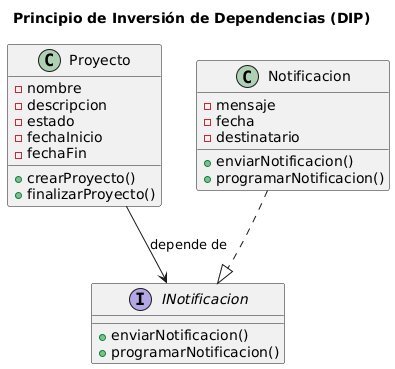

# Principio de Inversión de Dependencias (DIP)

## Propósito y Tipo del Principio SOLID

El Principio de Inversión de Dependencias (DIP) establece que los módulos de alto nivel no deben depender de los de bajo nivel, sino ambos de abstracciones.

---

## Motivación

En el sistema, la clase **Proyecto** dependía directamente de implementaciones concretas como **EmailNotificacion** o **WhatsAppNotificacion**.  
Esto genera rigidez: cualquier cambio en un canal afecta directamente al proyecto.

Con DIP, **Proyecto** depende de una abstracción (**INotificacion**) y no de clases concretas.  
De esta forma, se pueden agregar nuevos canales sin modificar la lógica del proyecto.

---

## Estructura de Clases

---

## Justificación Técnica

Con DIP:

- **Proyecto** no conoce detalles de cada notificación, solo depende de la abstracción **INotificacion**.

- Nuevos canales se integran implementando la interfaz, sin modificar la lógica de **Proyecto**.

Esto mejora la extensibilidad, reduce el acoplamiento y cumple el principio SOLID de inversión de dependencias.
